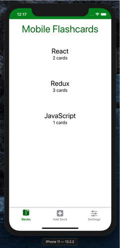
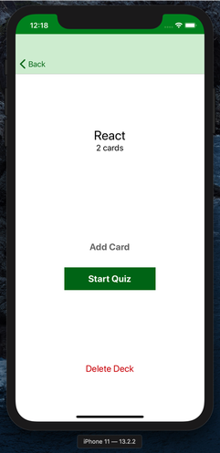
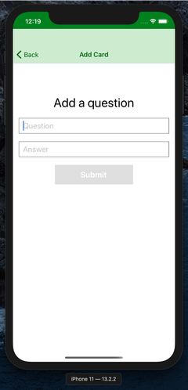
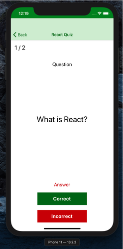
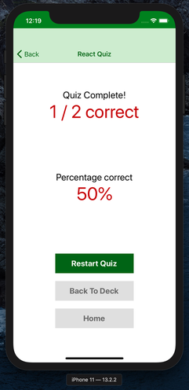
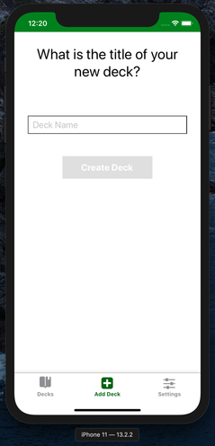
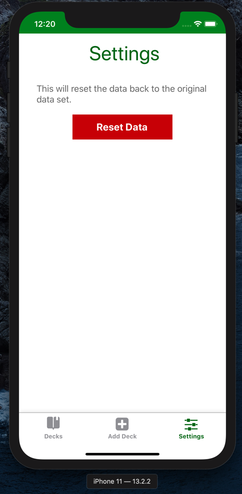
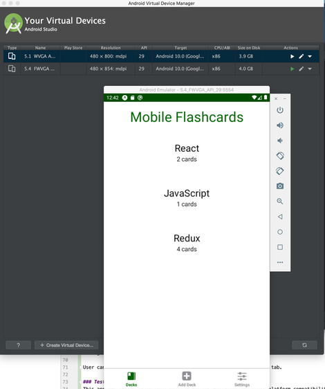

# Mobile-Flashcards
This application was built for mobile application (Android or iOS - or both) that allows users to study collections of flashcards. 
This app allows users to create different categories of flashcards called "decks", add flashcards to those decks, then take quizzes on those decks.


### Prerequisites

To start you need to have node package manager installed in your system.
The packages used in this application is set in package.json.

To install npm you can run following command in your terminal.

```
npm install npm@latest -g
```

Another alternative is to to use Expo CLI. You can install Expo CLI by running,

```
npm install -g expo-cli
```

### Installing
The application was created with **create-react-native-app** and requires only few steps to get started.

Besides default packages from create-react-app, the only additional packages installed are,

    "@expo/vector-icons": "^9.0.0",
    "expo": "^35.0.0",
    "expo-constants": "~7.0.0",
    "expo-permissions": "~7.0.0",
    "prop-types": "^15.7.2",
    "react": "16.8.3",
    "react-dom": "16.8.3",
    "react-native": "https://github.com/expo/react-native/archive/sdk-35.0.0.tar.gz",
    "react-native-gesture-handler": "~1.3.0",
    "react-native-reanimated": "~1.2.0",
    "react-native-screens": "~1.0.0-alpha.23",
    "react-native-web": "^0.11.7",
    "react-navigation": "^4.0.10",
    "react-navigation-stack": "^1.10.3",
    "react-navigation-tabs": "^2.6.2",
    "react-redux": "6.0.1",
    "redux": "^4.0.1",
    "redux-logger": "^3.0.6",
    "redux-thunk": "^2.3.0"


The application can easily be set and running through following commands

```
expo install
```

And,

```
expo start
```

After you start the project you should see the sign in page as shown in the screen below,

     

     



Through this app user can add deck and add flash cards on deck. The flash card contains question and an answer which can be added by the user. User can take quiz and get results at the end based on correct or incorrect answers.

User can also delete the deck created or reset the data in settings tab.

### Test
This app was tested using both Android and ios emulators for cross platform compatibility.

